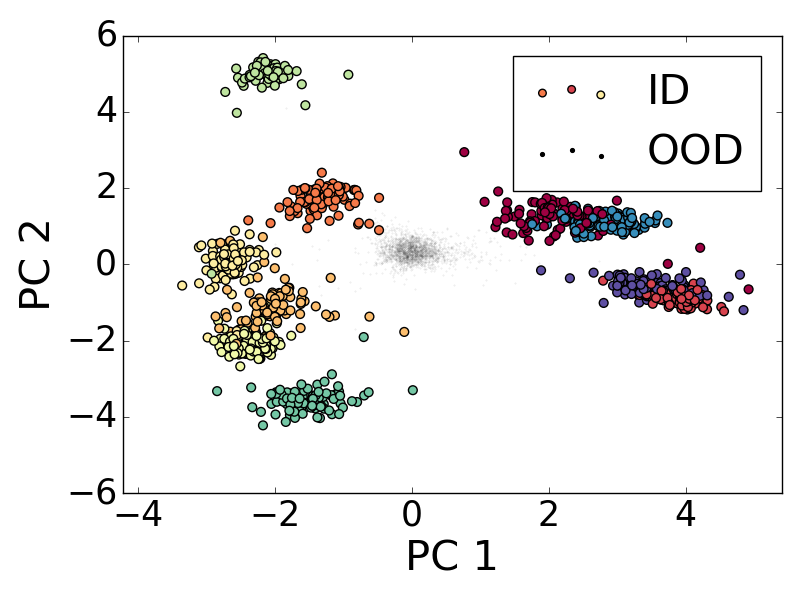
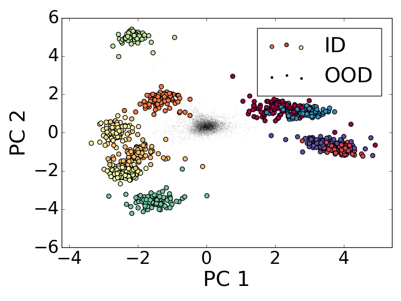
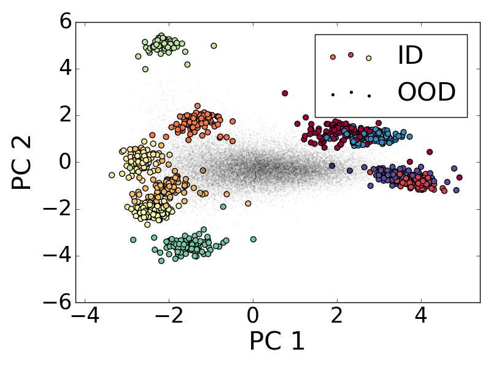

# NECO: NEural Collapse OOD detection

Official Pytorch implementation of the paper [NECO: NEural Collapse Based Out-of-distribution detection](https://arxiv.org/abs/2310.06823). 

This paper expands the **Neural Collapse** (NC) phenomenon from the ID-only case, and proves that OOD data are also affected by NC.

NC states that the representation learned by over-parametrized Neural networks (trained beyond accuracy convergence) tends towards the Equiangular Tight Frame structure.
This is a structure defined by equiangular/equinorm vertices, where each vertex represents a class cluster.
Additionaly each class cluster is reduced to its cluster center, due to intra-class covariance collapse, while maximising its covaraince with respect to other class clusters.

NECO proves that a similar behaviour affects OOD data cluster as well, and adds the NC metric to measure the convergence of this behaviour.

With the emergence of this behaviour in mind, NECO detects OOD using a simple projection to the ETF space, with relative norm computation.
In this representation sub-space, OOD data occupies the origin, while ID data cluster encircles it as shown in Figure below.

The figure below shows feature projections on the first 2 principal components of a PCA fitted on CIFAR-10 (ID) using ViT penultimate layer representation.
OOD data are ImageNet-O, Textures and SVHN.

| ImageNet-O | Textures | SVHN | 
| --- | --- | --- |
|  |  |  |


## DataSets

- [ImageNet](https://www.image-net.org/) : The ILSVRC 2012 dataset as In-distribution (ID) dataset. The training subset we used is [this file](datalists/imagenet2012_train_random_200k.txt).
- [OpenImage-O](https://github.com/openimages/dataset/blob/main/READMEV3.md) : The OpenImage-O dataset is a subset of the OpenImage-V3 testing set. The filelist is [here](datalists/openimage_o.txt). Please refer to [our paper of ViM](http://ooddetection.github.io) for details of dataset construction.
- [Texture](https://www.robots.ox.ac.uk/~vgg/data/dtd/) : We rule out four classes that coincides with ImageNet. The filelist used in the paper is [here](datalists/texture.txt).
- [iNaturalist](https://arxiv.org/pdf/1707.06642.pdf) : Follow the instructions in the [link](https://github.com/deeplearning-wisc/large_scale_ood) to prepare the iNaturalist OOD dataset.
- [ImageNet-O](https://github.com/hendrycks/natural-adv-examples) : Follow the guide to download the ImageNet-O OOD dataset.
- [OpenOOD](https://github.com/Jingkang50/OpenOOD) : For additional OOD datasets used.


## Required steps

1. [Model Training on ID data](#model-training-on-id-data) (if pre-trained weights are not available) : Trains ViT models on CIFAR10/CIFAR100 and ImagNet datasets.
2. [Feature extraction](#feature-extraction) : Extract and save the model's features for both ID and OOD datasets, for faster evaluation of NC and OOD detection.
3. [Neural Collapse evaluation](#neural-collapse-evaluation) and [OOD evaluation](#OOD-evaluation) : Evaluation of the evolution of NC metrics during training, and OOD detection performance at inference.


### Model Training on ID data

Refer to [ViT-pytorch](https://github.com/jeonsworld/ViT-pytorch) for pretrained checkpoints downloads and
places them in the checkpoints folder.


Finetuning:

```bash
python train.py --warmup_steps 200 --eval_every 90 --SHUFFLE True --num_steps 1000 --img_size 224 --name cifar10_vit --seed 17 --dataset cifar10 --pretrained_dir checkpoints/ViT-B_16-224.npz --fp16 --fp16_opt_level O2
```

Training from scratch

```bash
python train.py --from_scratch=True --warmup_steps=200 --eval_every=90 --SHUFFLE=True --num_steps=1000 --img_size=224 --name cifar10_vit --seed 17 --dataset cifar10 --pretrained_dir checkpoints/ViT-B_16-224.npz --fp16 --fp16_opt_level O2
```

Set ``` --test_NC=True ``` to save models at each evaluation step, for NC convergence evaluation.


### Feature extraction

```bash
python extract_feats.py --save_preds=True --model_architecture_type=... --in_dataset=... --out_dataset=...  --save_path=... --base_path=...
```

### OOD evaluation

```bash
python test_all_ood.py --in_dataset=... --out_dataset=... --model_name=...  --neco_dim=... 
```

### Neural Collapse evaluation

```bash
python NC_metrics.py --in_dataset=... --out_dataset=... --use_vit=... --model_name=... --use_ood=True
```

## References

* [OpenOOD](https://github.com/Jingkang50/OpenOOD) for dataset downloading
* [ViT-pytorch](https://github.com/jeonsworld/ViT-pytorch) for the training of ViT models, and feature extraction
* [ViM](https://github.com/haoqiwang/vim) for OOD benchmark evaluation
* [Neural Collapse](https://colab.research.google.com/github/neuralcollapse/neuralcollapse/blob/main/neuralcollapse.ipynb) for Neural collapse evaluation


## Citations

```bibtex
@misc{ammar2023neco,
      title={NECO: NEural Collapse Based Out-of-distribution detection}, 
      author={Mouïn Ben Ammar and Nacim Belkhir and Sebastian Popescu and Antoine Manzanera and Gianni Franchi},
      year={2023},
      eprint={2310.06823},
      archivePrefix={arXiv},
      primaryClass={stat.ML}
}
```
